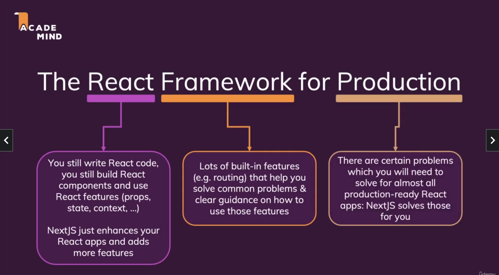
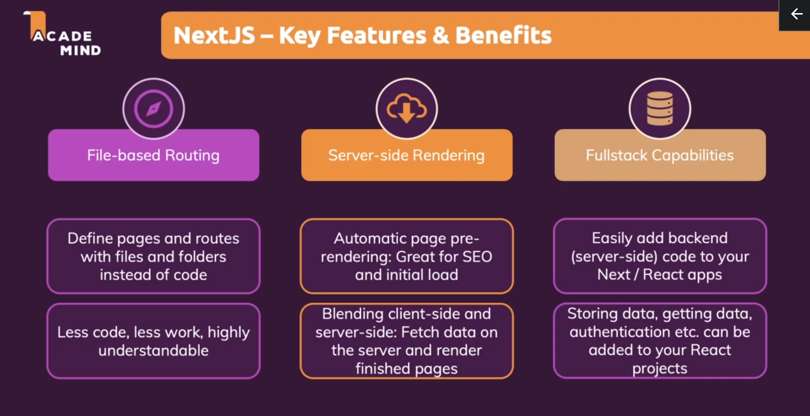
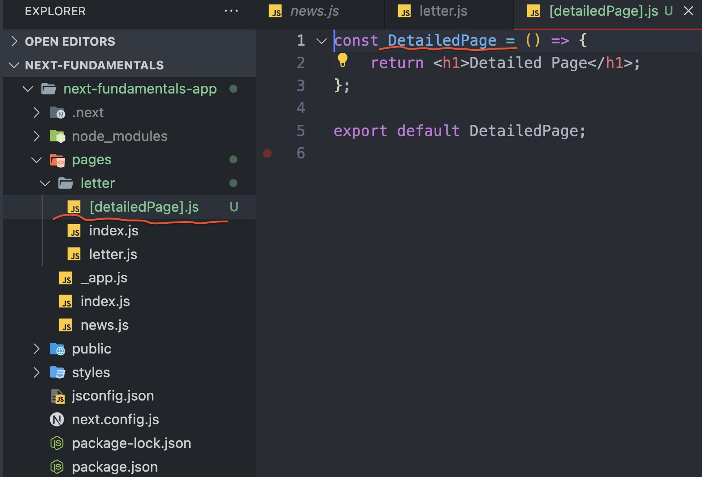
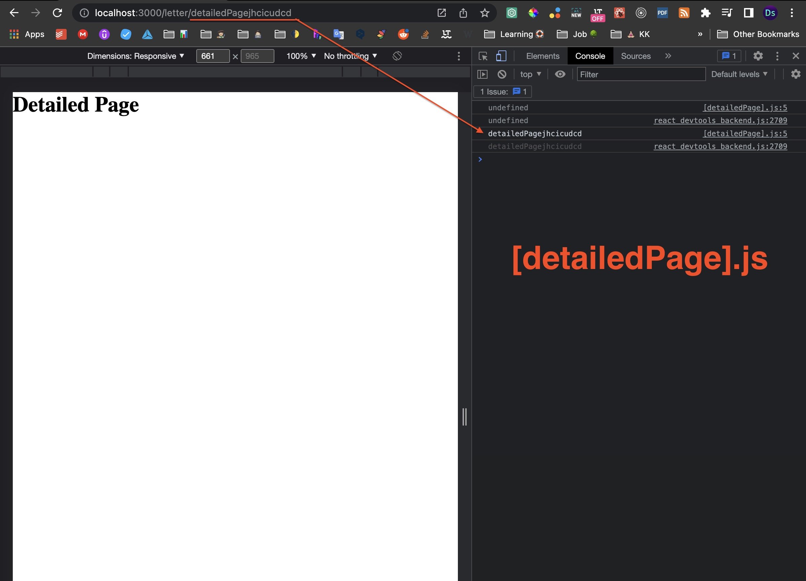

# Next.js-Fundamentals

## What is Next.js?

It is a fullstack **framework** for React.js, that enhances React features. It solves common problems & makes building React apps easier.

---

## Install Next.js

`npx create-next-app app-name`

---

## Difference between framework and library:

-   Framework is much bigger,
-   Framework has more features than library,
-   Framework is focusing on more things instead of just a single thing,
-   Framework is giving you clear rules & guidance on how you should write your code, how you should structure your files and so on.

---

## Next.js - Key Feature & Benefits

### 1. Server-side Rendering (SSR) support

Server-side rendering is all about preparing the content of a page on the server, instead of on the client. **SSR means that the content of your site is generated on the server, then sent to the browser.** This is useful for SEO purposes, because search engines can "see" the content of your site before they send it to users.

Server-side rendering is exactly what it sounds like: **rendering on the server**. When you do this, you'll create an HTML file with all of the content of the site and send it back to the user. **The user will then get an fully rendered HTML page that contains all of the necessary information for them to see your site without having to wait for any JavaScript or CSS files to load.** This means that users who visit your site will be able to see everything much faster than if they were just looking at blank screen while waiting for JavaScript files to load.

When done well, SSR can greatly **improve performance**, because it enables you to render content before it is sent down to the client. **It also reduces page load time** and **improves SEO** by sending the page's content earlier than if you were to send it after the page has loaded.

And since **React is a client side, JS library - all that rendering happens on the client, so in the browser of yours users! It is not happening on the server.** That is not necessarily a big problem, but it can be a problem. Because, if your page also fetches some data from a server that should be displayed in browser, then the user might initially see some loading state 🔄, a flickering page for fraction of a second, while request is on its way fetching the data. **Since, data fetching only begins once the JS code executed on the client --> then we still need to wait for the response of that outgoing request (Page which we requested did not yet contain that data).**

If that page would be pre-rendered on the server, if that Data Fetching somehow could be done on the server, when the request hits that server & as then the finished page would be served to our users and search engine crawlers (As a final result), then users would not have that flickering loading state & search engines would see our page content. And that is the problem SSR solves - it allows us prerender React components on a server - all content is already there.

### 2. File-based Routing

Routing means that we are giving to user illusion of having multiple pages. This router basically watches the URL, and when it changes, it basically prevents the browser default of sending a request to some backend server. And instead renders different content (different component in the end) on the page with React.

Next.js allows us to get rid of extra routing code & hence we have to right less code we have less work.

### 3. Fullstack Capabilities

Next.js also makes it easy for us as a developers to add backend code to our react project.

---

### How add dynamic page with Next.js

**What you will type in URL you will get the same value as router**👇

---
